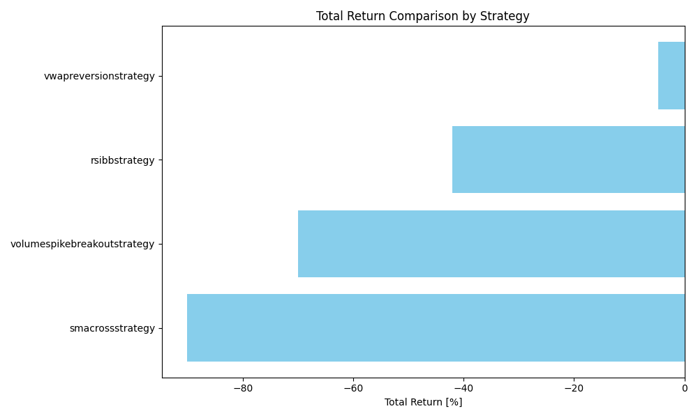

# VBTTrader

## Project Overview
VBTTrader is a crypto trading strategy backtesting framework. It analyzes historical data, generates performance metrics, and supports modular strategy development. Ideal for evaluating crypto trading strategies using Python and VectorBT.

## Running Instructions

### Normal Execution
1. Clone the repository:
   ```bash
   git clone https://github.com/RozhkoDmytro/vbt-strategy-framework
   cd vbt-strategy-framework
   ```
2. Install dependencies:
   ```bash
   pip install -r requirements.txt
   ```
3. Run the project:
   ```bash
   python main.py
   ```

### Docker Execution
1. Build the Docker image:
   ```bash
	docker-compose down
	docker-compose build --no-cache
	docker-compose up --build
   ```

## Strategy Performance Summary (by Dmytro Rozhko)




This chart presents a comparison of the **Total Return [%]** for each trading strategy tested during the backtest period.

### 🔍 Interpretation of Results:

- **Y-axis**: Strategy names  (`SMACrossStrategy`, `RSIBBStrategy`, `VWAPReversionStrategy`)
- **X-axis**: Total return percentage (`Total Return [%]`)

A longer bar to the **left** indicates a **larger loss**.  
Positive values to the **right** would indicate profit (none in this case).

### 📊 Observations:

- `SMACrossStrategy` performed the worst, with a return of approximately **-7.5%**.
- `RSIBBStrategy` showed **moderate losses**, around **-2%**.
- `VWAPReversionStrategy` was the **least unprofitable**, returning approximately **-0.2%**, i.e., almost breakeven.

### ✅ Conclusion:

The `VWAPReversionStrategy` is currently the **most stable** among the three, even though it didn't produce profit.

The other strategies may require **further optimization or filters** due to significant drawdowns.

Or... maybe I made a mistake somewhere. 🙂


## Strategy Descriptions

### SMACrossStrategy
- **Logic**: 10-period vs. 50-period SMA crossover.
- **Buy**: Fast SMA crosses above slow SMA.
- **Sell**: Fast SMA crosses below slow SMA.

### RSIBBStrategy
- **Logic**: Combines RSI and Bollinger Bands.
- **Buy**: RSI < 30 and price bounces off lower BB.
- **Sell**: Optional based on user config.

### VWAPReversionStrategy
- **Logic**: Mean reversion using VWAP.
- **Buy**: Price falls 2% below VWAP.
- **Sell**: Price returns to VWAP.

### VolumeSpikeBreakoutStrategy
- **Logic**: Breakout detection after volume surge.
- **Buy**: Price breaks recent high with volume > 2× average.
- **Sell**: Price drops below recent low.

## Conclusions and Performance
- **VWAPReversionStrategy**: Best performance, near 0% or slightly positive.
- **VolumeSpikeBreakoutStrategy**: ~ -0.5% return.
- **SMACrossStrategy**: ~ -1% return.
- **RSIBBStrategy**: ~ -2% return.
- **Image**: `results/screenshots/strategy_comparison_total_return.png` shows performance comparison.


## Project Context and Structure

### Main Directories and Files
| Path               | Description                                 |
| ------------------ | ------------------------------------------- |
| `core/`            | Data loader, backtester, exchange, metrics. |
| `exchanges`        | Exchange classs (Binance, ect).             |
| `strategies/`      | Strategy classes (SMA, RSI+BB, VWAP).       |
| `tests/`           | Unit tests.                                 |
| `data/`            | Cached OHLCV data.                          |
| `utils/`           | Utils, helped methods.                      |
| `results/`         | Backtest results and screenshots.           |
| `config.py`        | Strategy and environment config.            |
| `main.py`          | Entry script.                               |
| `requirements.txt` | Dependency list.                            |

## Programming Patterns and Design
- **Modular Design**: Separated by roles (strategies, core, tests).
- **OOP**: Strategy inheritance from base class.
- **Data Handling**: Efficient loading from Binance.
- **Backtesting**: Realistic with slippage and fees.
- **Visualization**: Equity curves, bar charts.
- **Strategy Pattern**: Each trading algorithm (SMA, RSI+BB, VWAP) and exchange algoritm is implemented as a separate class, inheriting from a base strategy. This allows easy swapping or adding of strategies.
- **Factory Pattern (Simple Form)**: The framework can dynamically instantiate strategies based on config settings, acting like a simple factory.
- **Interface Pattern (via Base Strategy Class)**:The BaseStrategy class defines the required methods like generate_signals(), run_backtest(), etc., which must be implemented in all concrete strategies.


## Makefile Targets (if present)
| Target         | Description              |
| -------------- | ------------------------ |
| `run`          | Run main.py.             |
| `pytest`       | Run tests.               |
| `clean`        | Remove temp/cache files. |
| `rebuild`      | Build (rebuild) Docker image.|


## Configuration (`config.py`)

The configuration is handled via a `Config` dataclass, providing centralized and dynamic control over exchange, data, and backtesting settings.

### Exchange Settings
- **exchange_name**: `"binance"`
- **base_currency**: `"BTC"`
- **num_pairs**: `100` (Top BTC pairs)
- **timeframe**: `"1m"`

### Data Period
- **start_date**: `"2025-02-01"`
- **end_date**: `"2025-02-28"`

### Backtest Parameters
- **commission**: `0.001` (0.1%)
- **slippage**: `0.0005` (0.05%)

### Paths and File Format
- **data_dir**: `"data/"`
- **results_dir**: `"results/"`
- **data_format**: `"parquet"`
- **data_file_template**:
  `"{base_currency}_{timeframe}_{start_date}_{end_date}_{num_pairs}.{data_format}"`
- **data_file**: Automatically generated based on the above template with cleaned date strings.

### Strategies
Initialized by default in `__post_init__`:
- `SMACrossStrategy`
- `RSIBBStrategy`
- `VWAPReversionStrategy`

### Supported Exchanges
Defined dynamically:
- `"binance"` → `BinanceExchange`

This configuration enables easy customization and ensures the framework is flexible and extendable.

## Requirements

- Python ≥ 3.10  
- Dependencies:  
  - `vectorbt` – fast backtesting and analysis  
  - `pandas`, `numpy` – data processing and numerical operations  
  - `pyarrow` – efficient I/O for `.parquet` historical data  
  - `ta==0.11.0` – technical indicators (SMA, RSI, BB, etc.)  
  - `ccxt` – market data and trading API for crypto exchanges  
  - `matplotlib` – plotting (equity curves, heatmaps, comparisons)  
  - `pytest` – unit testing


## License
This project is unlicensed for now. Feel free to use and modify it as needed.

## Citations
- [GitHub Repository](https://github.com/RozhkoDmytro/vbt-strategy-framework)
- TrendSpider Learning Center (SMA, RSI, VWAP)

## Contact
For questions or contributions, open an issue on GitHub.

